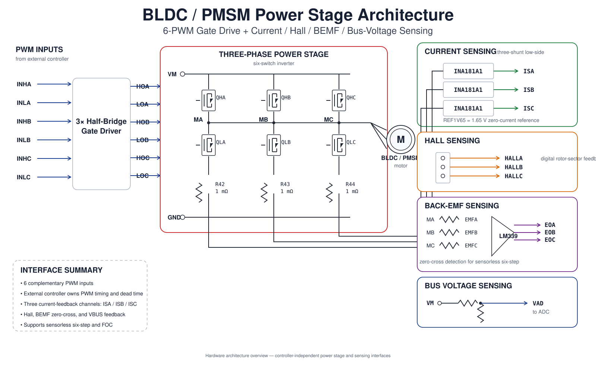
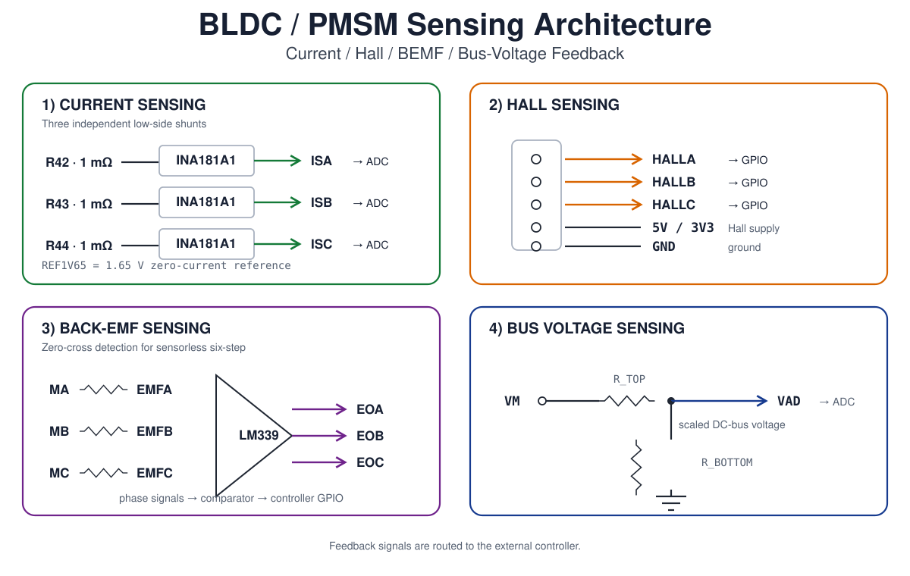

# BLDC / PMSM Motor Control

Embedded motor-control development project for BLDC and PMSM drives, covering sensorless six-step commutation, three-phase current sensing, Hall and back-EMF feedback, and field-oriented control (FOC).

## Why This Project

The initial hardware platform is a vendor-validated, known-good three-phase inverter board with gate drivers, three-shunt low-side current sensing, Hall inputs, back-EMF sensing, and DC-bus voltage feedback.

The objective is not simply to make a motor spin or reproduce vendor firmware. The board is used as a stable physical motor-control platform for understanding how switching hardware, sensing, timing, estimation, commutation, and closed-loop control interact.

By starting from known-good power hardware, development effort can focus on controller implementation, sensing, timing, commutation, and control algorithms rather than power-electronics hardware bring-up.

Two primary control paths are developed on the same hardware:

- **Sensorless six-step commutation** using back-EMF zero-cross detection;
- **Field-Oriented Control (FOC)** using synchronized phase-current measurement and vector control.

The project emphasizes reproducible measurements, independent firmware development, and comparison of control strategies under consistent electrical and mechanical conditions.

## System

The initial hardware is a three-phase, six-switch BLDC/PMSM inverter with 6-PWM gate control and multiple feedback paths. The controller itself is intentionally kept outside the hardware boundary: the power stage exposes PWM inputs and sensing outputs to an external controller implementation.

<!--  -->

The sensing paths are documented separately so that power conversion and controller feedback remain distinct architectural concerns.

<!--  -->

| Function | Initial implementation |
| --- | --- |
| Power stage | Three-phase, six-switch inverter |
| Input voltage | 12–36 VDC |
| PWM interface | 6-PWM |
| Current sensing | INA181A1 ×3 with 5 mΩ low-side shunts |
| Hall feedback | HALLA / HALLB / HALLC |
| BEMF feedback | EMFA / EMFB / EMFC + LM339 |
| Bus-voltage feedback | VAD |
| MCU | External |
| Primary control paths | Sensorless six-step and FOC |

See [Hardware Overview](docs/hardware-overview.md) for the detailed board-level description.

## Control Paths

### Sensorless Six-Step

Uses the floating phase back-EMF signal to detect zero crossings and derive commutation timing after an open-loop startup sequence.

See [Sensorless Six-Step Control](docs/sensorless-six-step.md).

### Field-Oriented Control

Uses synchronized phase-current sampling, Clarke/Park transforms, `Id` / `Iq` current control, and SVPWM. Rotor electrical angle may initially come from Hall sensors or an external encoder, with sensorless estimation treated as a later extension.

See [Field-Oriented Control](docs/foc.md).

## Documentation

Detailed engineering notes are kept under [`docs/`](docs/) so the README remains a project landing page.

- [Design Principles](docs/design.md) — physical-plant-first development and measurement-driven validation.
- [Software Architecture](docs/software-architecture.md) — separation of PWM/ADC/timing from sensing, motor state, control algorithms, and supervision.
- [Hardware Overview](docs/hardware-overview.md) — power stage, gate drive, interfaces, and nominal board parameters.
- [Electrical Connectivity Baseline](docs/electrical-connectivity.md) — project-maintained connectivity reference extracted from the known-good vendor hardware.
- [Sensing Architecture](docs/sensing.md) — phase-current, BEMF, Hall, and DC-bus voltage sensing.
- [Hardware Bring-Up](docs/bring-up.md) — staged controller-to-hardware integration from power rails through closed-loop motor control.
- [Sensorless Six-Step Control](docs/sensorless-six-step.md) — startup, BEMF qualification, zero-cross detection, and commutation timing.
- [Field-Oriented Control](docs/foc.md) — current acquisition, transforms, current loops, rotor angle, and SVPWM.
- [Validation and Benchmarking](docs/validation.md) — common measurements and comparison criteria.
- [Safety](docs/safety.md) — electrical, switching, regenerative, and measurement safety considerations.

## Reference Baseline

Existing vendor material provides a known-good hardware and firmware reference based on STM32F405/VESC-derived firmware, ESP32/SimpleFOC, AT32 sensorless six-step control, and STM32F103 motor-control examples.

The vendor-validated board and its original schematic/documentation form the initial hardware reference baseline. Vendor firmware and third-party implementations are used for comparison and bring-up reference rather than as the architectural basis of the project's independent controller implementation.

Vendor firmware, documentation, and third-party source code are not redistributed unless their respective licenses explicitly permit redistribution.

## Status

Early-stage project.

Current focus: **controller integration, power-stage characterization, sensing validation, and establishment of a measured baseline before independent sensorless six-step and FOC development.**

## License

To be determined.
