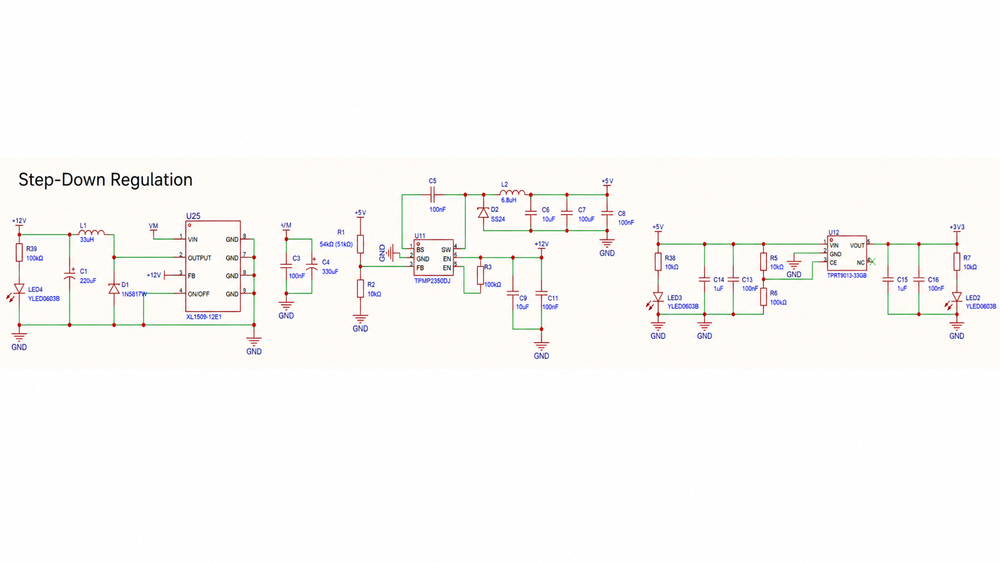

# Hardware Overview

The initial platform is a vendor-validated, known-good three-phase BLDC/PMSM inverter board intended for external-MCU control.

The board is treated as the project's initial hardware baseline. The development focus is therefore controller integration, measurement, and control behavior rather than redesigning the power stage.

## Power Stage

The power stage is a three-phase, six-switch inverter:

```text
                VM
                 │
       ┌─────────┼─────────┐
       │         │         │
      Q1        Q3        Q5
       │         │         │
      MA        MB        MC
       │         │         │
      Q2        Q4        Q6
       │         │         │
     R42       R43       R44
     5 mΩ      5 mΩ      5 mΩ
       │         │         │
      GND       GND       GND
```

### Schematic-Derived Hardware Data

| Parameter | Value |
| --- | --- |
| Motor type | BLDC / PMSM |
| Power-stage topology | Three-phase, six-switch inverter |
| Main MOSFET | HYG065N07 ×6 |
| PWM interface | 6-PWM |
| Phase current sensing | Three-shunt low-side |
| Current-sense amplifier | INA181A1 ×3 |
| Current shunt | 5 mΩ ×3 |
| Current-sense reference | 1.65 V |
| Hall feedback | HALLA / HALLB / HALLC |
| Back-EMF sensing | EMFA / EMFB / EMFC |
| BEMF comparator | LM339 |
| Comparator outputs | EOA / EOB / EOC |
| DC-bus voltage feedback | VAD |
| MCU | External |

### Vendor-Stated Operating Data

| Parameter | Value |
| --- | --- |
| Input voltage | 12–36 VDC |
| Continuous output current | 10 A |
| Maximum output current | 20 A |
| Nominal maximum power | 500 W |

The operating ratings above are vendor-stated values for the initial board and should be distinguished from schematic-derived electrical facts. They do not constrain later controller implementations.

## Power Regulation

The board includes the local step-down regulation required to derive the logic and gate-drive supply rails from the input bus.



This regulation circuitry is part of the vendor-validated hardware baseline. Controller integration should verify the expected rails are present and stable, but does not treat the regulator design itself as a development target unless measurements indicate a hardware issue.

## PWM / Gate Drive

The board exposes independent high-side and low-side control for each phase:

```text
Phase A: INHA / INLA
Phase B: INHB / INLB
Phase C: INHC / INLC
```

The external MCU is responsible for complementary PWM generation, dead time, timer synchronization, ADC trigger timing, safe disabled states, and fault shutdown behavior.

Because the power board is already known-good, controller bring-up should concentrate on verifying the controller-to-board interface:

```text
MCU PWM
   ↓
Gate-Driver Input
   ↓
MOSFET Gate
   ↓
Phase Switching Node
```

PWM polarity, effective dead time, enable/disable behavior, and switching timing must be confirmed with the intended controller before normal motor operation.

## Motor Outputs

The three motor phases are exposed as:

```text
MA
MB
MC
```

Phase order and rotation direction must be verified during controller integration rather than assumed from labeling alone.

## External MCU Interface

The board provides the signals required for several motor-control strategies:

- six PWM control inputs;
- three phase-current outputs (`ISA`, `ISB`, `ISC`);
- Hall inputs (`HALLA`, `HALLB`, `HALLC`);
- analog back-EMF signals (`EMFA`, `EMFB`, `EMFC`);
- comparator back-EMF outputs (`EOA`, `EOB`, `EOC`);
- DC-bus voltage feedback (`VAD`);
- logic supply and ground connections.

The MCU is therefore an implementation choice rather than part of the architectural identity of the project.
